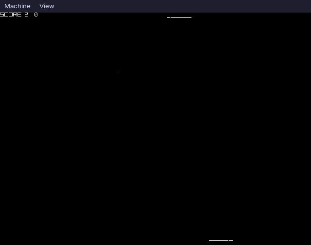

# [PiZilla]

A bare metal OS kernel for the Raspberry Pi 3B, written in Zig.



## Features

- Bare metal aarch64 boot via custom assembly bootloader
- Mini UART driver for serial I/O
- Mailbox interface for VideoCore GPU communication
- Framebuffer driver with pixel and line drawing
- Bitmap font rendering
- Timer driver
- Pong game (player vs AI) with keyboard input

## Requirements

- [Zig](https://ziglang.org/) 0.17 or later
- [QEMU](https://www.qemu.org/) with `qemu-system-aarch64` for emulation

## Usage
Clone the repository
```
git clone https://github.com/vedjain773/PiZilla.git
```
```
```

Build the project
```
make
```

Run on QEMU
```
make qemu-d
```
## Project Structure
```
.
├── asm
│   ├── boot.S
│   ├── entry.S
│   ├── irq.S
│   └── mm.S
├── build.zig
├── header
│   ├── entry.h
│   ├── mm.h
│   └── sysregs.h
├── Makefile
├── README.md
└── src
    ├── font.zig
    ├── framebuffer.zig
    ├── gpio.zig
    ├── irq.zig
    ├── linker.ld
    ├── mailbox.zig
    ├── main.zig
    ├── mini_uart.zig
    ├── pong.zig
    ├── print.zig
    ├── timer.zig
    └── utils.zig
```

```
```
## Controls

| Key | Action |
|-----|--------|
| `a` | Move paddle left |
| `d` | Move paddle right |

## Acknowledgements

- [raspberry-pi-os](https://github.com/s-matyukevich/raspberry-pi-os)
- [NovaPi](https://github.com/moxybaba/NovaPi)
